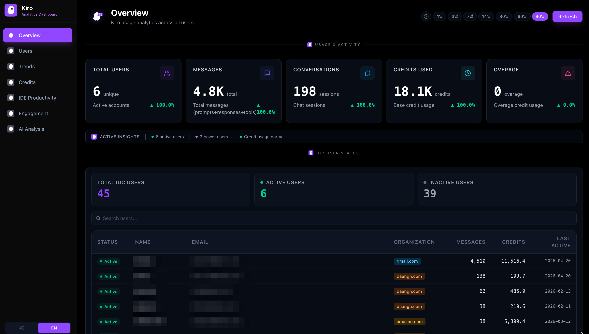
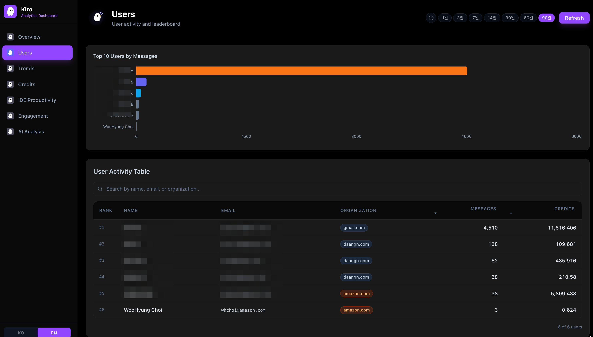
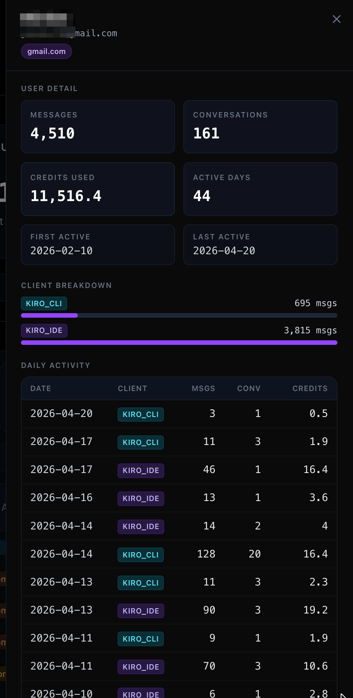
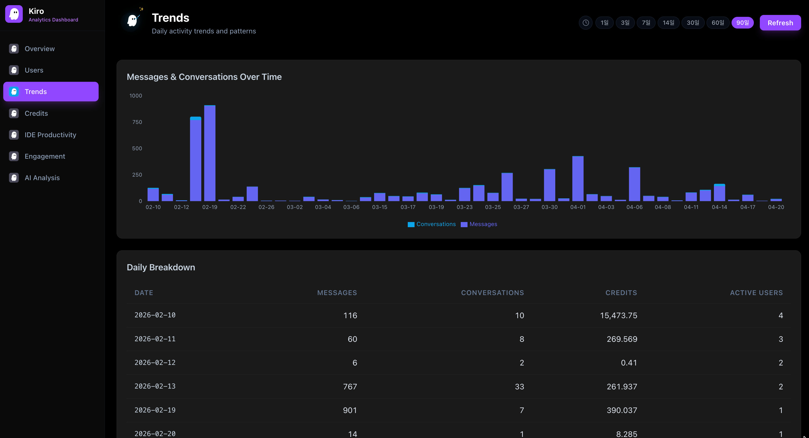
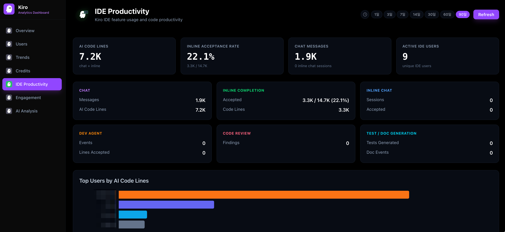
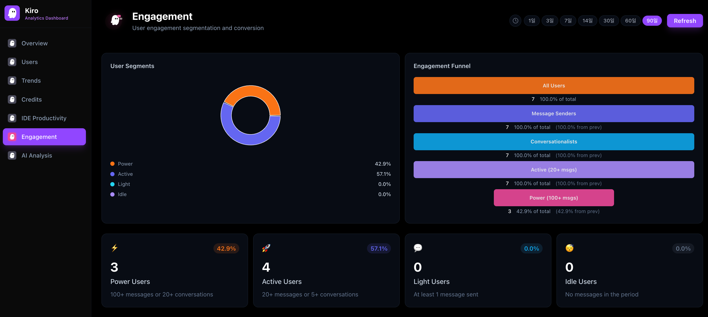
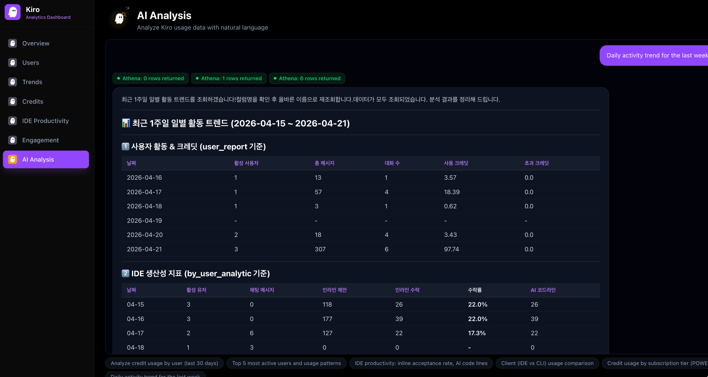

# kiro-dashboard

[](LICENSE)
[]()
[]()
[]()
[](#english)
[](#한국어)

**EN** Kiro IDE user analytics dashboard with AI-powered analysis on AWS
**KR** AWS 기반 AI 분석 기능을 갖춘 Kiro IDE 사용자 분석 대시보드

---

# English

## Overview

kiro-dashboard is a full-stack analytics platform that visualizes Kiro IDE usage data. It queries user activity reports stored in S3 via Athena, renders interactive charts with Recharts, and provides natural language analysis powered by Amazon Bedrock Claude Sonnet 4.6. The dashboard is deployed on ECS Fargate behind CloudFront and ALB with Cognito authentication.

### Dashboard Overview



### User Activity and Leaderboard



### User Detail Drill-down



### Daily Trends



### IDE Productivity Metrics



### Engagement Segmentation



### AI-Powered Natural Language Analysis



## Features

- **Real-time Usage Analytics** — Track users, messages, conversations, credits, and overage across configurable time periods (1 minute to 90 days)
- **IDE Productivity Metrics** — Analyze inline completion rates, AI code lines, chat interactions, dev agent usage, and code review findings from the 46-column legacy report
- **Identity Center Integration** — Map all IdC users to display names, emails, and organizations with active/inactive status tracking
- **AI-Powered Analysis** — Ask natural language questions about Kiro data; Claude Sonnet 4.6 autonomously generates Athena SQL, executes queries, and produces Korean markdown reports
- **User Detail Drill-down** — Click any user row to see daily activity breakdown, client type usage, and conversation history in a slide-in panel
- **Animated Kiro Mascot** — Page-themed Kiro ghost character with eye-blinking, bouncing, and contextual accessories (dashboard grid, trend arrows, code terminal, chat bubbles)
- **Bilingual Interface** — Full Korean/English toggle with sidebar language switcher
- **Lambda@Edge Authentication** — CDN-level Cognito PKCE authentication via Lambda@Edge; no auth logic in the app
- **Data Masking** — Server-side masking of all user identifiers (names, emails, organizations) showing only first 2 characters
- **Model Usage Analysis** — Per-model message distribution (Auto, Claude Opus, Claude Sonnet), daily trends, Auto vs manual selection ratio, and user model preference table via S3 direct CSV parsing

## Prerequisites

- Node.js >= 18
- Docker (for container builds)
- AWS CLI v2 (configured with appropriate credentials)
- AWS CDK CLI (`npm install -g aws-cdk`)
- AWS Account with access to: ECS, ECR, CloudFront, ALB, Athena, Glue, S3, Cognito, IAM Identity Center, Bedrock

## Installation

```bash
# Clone the repository
git clone https://github.com/whchoi98/kiro-dashboard.git
cd kiro-dashboard

# Install frontend dependencies
npm install

# Install CDK dependencies
cd infra && npm install && cd ..

# Copy environment file and configure
cp .env.example .env.local
# Edit .env.local with your AWS configuration
```

## Usage

```bash
# Start local development server
npm run dev
# Open http://localhost:3000

# Build for production
npm run build

# Deploy to AWS (first time)
cd infra
export CDK_DEFAULT_ACCOUNT=<your-account-id>
export CDK_DEFAULT_REGION=ap-northeast-2
npx cdk bootstrap
npx cdk deploy --all

# Build and push Docker image
docker build -t kiro-dashboard .
aws ecr get-login-password --region ap-northeast-2 | \
  docker login --username AWS --password-stdin <account>.dkr.ecr.ap-northeast-2.amazonaws.com
docker tag kiro-dashboard:latest <account>.dkr.ecr.ap-northeast-2.amazonaws.com/kiro-dashboard:latest
docker push <account>.dkr.ecr.ap-northeast-2.amazonaws.com/kiro-dashboard:latest

# Force ECS service update
aws ecs update-service --cluster kiro-dashboard-cluster \
  --service <service-name> --force-new-deployment
```

## Configuration

| Variable | Description | Default |
|----------|-------------|---------|
| `AWS_REGION` | AWS region for Athena/Glue/Identity Store | `us-east-1` |
| `ATHENA_DATABASE` | Glue database name | `titanlog` |
| `ATHENA_OUTPUT_BUCKET` | S3 path for Athena query results | `s3://whchoi01-titan-q-log/athena-results/` |
| `GLUE_TABLE_NAME` | Primary Glue table name | `user_report` |
| `IDENTITY_STORE_ID` | IAM Identity Center store ID | `` |
| `S3_REPORT_PREFIX` | S3 prefix for user_report CSV files | `q-user-log/AWSLogs/.../user_report/us-east-1/` |

## Project Structure

```
app/                        Next.js App Router
  api/                      12 API routes
    analyze/                Bedrock AI analysis (SSE streaming)
    metrics/                KPI aggregations
    users/                  User rankings with IdC details
    trends/                 Daily activity trends
    credits/                Credit usage analysis
    engagement/             User segmentation and funnel
    productivity/           IDE productivity metrics
    idc-users/              Identity Center user status
    user-detail/            Per-user activity drill-down
    client-dist/            Client type distribution
    model-usage/            AI model usage analysis (S3 direct read)
    health/                 ECS health check
  components/               Shared React components
    layout/                 Sidebar (with logout), Header, KiroLogo
    charts/                 MetricCard, TrendChart, PieChart, BarChart, FunnelChart, IdcUserStatus
    tables/                 UserTable (sortable, searchable)
    ui/                     KiroIcon, KiroMascot, DateRangePicker, UserDetailPanel
  analyze/                  AI analysis chat page
  users/                    User activity page
  credits/                  Credit usage page
  trends/                   Activity trends page
  engagement/               Engagement metrics page
  productivity/             IDE productivity page
  model-usage/              AI model usage analysis page
lib/                        Shared libraries
  athena.ts                 Athena query client + NORMALIZE_USERID
  glue.ts                   Glue table resolver
  identity.ts               Identity Center user resolver (with masking)
  mask.ts                   Data masking utilities
  i18n.tsx                  Korean/English i18n context
types/                      TypeScript interfaces
  dashboard.ts              All data model types
infra/                      AWS CDK infrastructure
  bin/app.ts                CDK app entry (5 stacks)
  lib/network-stack.ts      VPC (new or existing mgmt-vpc)
  lib/security-stack.ts     Security groups, Cognito, EdgeAuthClient
  lib/ecs-stack.ts          ECS Fargate, ALB, ECR, IAM, Auto Scaling
  lib/cdn-stack.ts          CloudFront + Lambda@Edge + SSM config
  lambda/edge-auth/         Lambda@Edge Cognito auth (PKCE + JWT)
public/                     Static assets
  kiro-logo.svg             Kiro ghost character SVG
docs/                       Architecture, ADRs, specs
```

## Testing

```bash
# Run project structure tests
bash tests/run-all.sh

# Verify Next.js build
npm run build

# Verify CDK synthesis
cd infra && npx cdk synth --all

# Test Docker build
docker build -t kiro-dashboard .

# Test health endpoint
curl http://localhost:3000/api/health
```

## Contributing

1. Fork the repository
2. Create a feature branch (`git checkout -b feat/add-new-chart`)
3. Commit changes (`git commit -m 'feat: add new chart component'`)
4. Push to the branch (`git push origin feat/add-new-chart`)
5. Open a Pull Request

Follow [Conventional Commits](https://www.conventionalcommits.org/) format:
- `feat:` new feature
- `fix:` bug fix
- `docs:` documentation
- `chore:` maintenance

## License

This project is licensed under the MIT License. See the [LICENSE](LICENSE) file for details.

## Contact

- Maintainer: WooHyung Choi / [whchoi98](https://github.com/whchoi98)
- Issues: [GitHub Issues](https://github.com/whchoi98/kiro-dashboard/issues)

---

# 한국어

## 개요

kiro-dashboard는 Kiro IDE 사용 데이터를 시각화하는 풀스택 분석 플랫폼입니다. S3에 저장된 사용자 활동 리포트를 Athena로 쿼리하고, Recharts로 인터랙티브 차트를 렌더링하며, Amazon Bedrock Claude Sonnet 4.6으로 자연어 분석 기능을 제공합니다. 대시보드는 CloudFront와 ALB 뒤의 ECS Fargate에 배포되며, Cognito 인증을 사용합니다.

### 대시보드 개요


### 사용자 활동 및 리더보드


### 사용자 상세 드릴다운


### 일별 트렌드


### IDE 생산성 메트릭


### 참여도 세그먼트


### AI 기반 자연어 분석


## 주요 기능

- **실시간 사용 분석** — 사용자, 메시지, 대화, 크레딧, 초과 크레딧을 1분~90일 범위로 추적합니다
- **IDE 생산성 메트릭** — 46개 컬럼 레거시 리포트에서 인라인 수락률, AI 코드 라인, 채팅, Dev Agent, 코드 리뷰를 분석합니다
- **Identity Center 통합** — 모든 IdC 사용자를 이름, 이메일, 소속으로 매핑하고 활성/비활성 상태를 추적합니다
- **AI 기반 분석** — Kiro 데이터에 대한 자연어 질문을 처리합니다. Claude Sonnet 4.6이 Athena SQL을 자율 생성하고 실행하여 한국어 마크다운 리포트를 생성합니다
- **사용자 상세 드릴다운** — 사용자 행 클릭 시 일별 활동 내역, 클라이언트 유형별 사용량, 대화 이력을 슬라이드 패널로 확인합니다
- **애니메이션 Kiro 마스코트** — 페이지별 테마에 맞는 Kiro 유령 캐릭터가 눈 깜빡임, 바운스, 상황별 액세서리(대시보드 그리드, 트렌드 화살표, 코드 터미널, 채팅 말풍선)를 표시합니다
- **이중 언어 인터페이스** — 사이드바 언어 전환기를 통한 한국어/영어 완전 지원
- **Lambda@Edge 인증** — CDN 레벨 Cognito PKCE 인증 (Lambda@Edge), 앱 내 인증 로직 없음
- **데이터 마스킹** — 모든 사용자 식별자(이름, 이메일, 소속)를 서버 측에서 마스킹하여 첫 2글자만 표시
- **모델 사용 분석** — 모델별 메시지 분포(Auto, Claude Opus, Claude Sonnet), 일별 트렌드, Auto vs 수동 선택 비율, 사용자별 모델 선호도 테이블 (S3 CSV 직접 파싱)

## 사전 요구 사항

- Node.js >= 18
- Docker (컨테이너 빌드용)
- AWS CLI v2 (적절한 자격 증명으로 설정)
- AWS CDK CLI (`npm install -g aws-cdk`)
- AWS 계정: ECS, ECR, CloudFront, ALB, Athena, Glue, S3, Cognito, IAM Identity Center, Bedrock 접근 권한 필요

## 설치 방법

```bash
# 저장소 복제
git clone https://github.com/whchoi98/kiro-dashboard.git
cd kiro-dashboard

# 프론트엔드 의존성 설치
npm install

# CDK 의존성 설치
cd infra && npm install && cd ..

# 환경 파일 복사 및 설정
cp .env.example .env.local
# .env.local을 AWS 설정에 맞게 편집합니다
```

## 사용법

```bash
# 로컬 개발 서버 시작
npm run dev
# http://localhost:3000 접속

# 프로덕션 빌드
npm run build

# AWS에 배포 (최초)
cd infra
export CDK_DEFAULT_ACCOUNT=<계정-ID>
export CDK_DEFAULT_REGION=ap-northeast-2
npx cdk bootstrap
npx cdk deploy --all

# Docker 이미지 빌드 및 푸시
docker build -t kiro-dashboard .
aws ecr get-login-password --region ap-northeast-2 | \
  docker login --username AWS --password-stdin <계정>.dkr.ecr.ap-northeast-2.amazonaws.com
docker tag kiro-dashboard:latest <계정>.dkr.ecr.ap-northeast-2.amazonaws.com/kiro-dashboard:latest
docker push <계정>.dkr.ecr.ap-northeast-2.amazonaws.com/kiro-dashboard:latest

# ECS 서비스 강제 업데이트
aws ecs update-service --cluster kiro-dashboard-cluster \
  --service <서비스명> --force-new-deployment
```

## 환경 설정

| 변수명 | 설명 | 기본값 |
|--------|------|--------|
| `AWS_REGION` | Athena/Glue/Identity Store AWS 리전 | `us-east-1` |
| `ATHENA_DATABASE` | Glue 데이터베이스 이름 | `titanlog` |
| `ATHENA_OUTPUT_BUCKET` | Athena 쿼리 결과 S3 경로 | `s3://whchoi01-titan-q-log/athena-results/` |
| `GLUE_TABLE_NAME` | 기본 Glue 테이블 이름 | `user_report` |
| `IDENTITY_STORE_ID` | IAM Identity Center 스토어 ID | `` |
| `S3_REPORT_PREFIX` | user_report CSV 파일 S3 경로 프리픽스 | `q-user-log/AWSLogs/.../user_report/us-east-1/` |

## 프로젝트 구조

```
app/                        Next.js App Router
  api/                      12개 API 라우트
    analyze/                Bedrock AI 분석 (SSE 스트리밍)
    metrics/                KPI 집계
    users/                  IdC 정보 포함 사용자 순위
    trends/                 일별 활동 추이
    credits/                크레딧 사용 분석
    engagement/             사용자 세그먼트 및 퍼널
    productivity/           IDE 생산성 메트릭
    idc-users/              Identity Center 사용자 상태
    user-detail/            개별 사용자 활동 드릴다운
    client-dist/            클라이언트 유형별 분포
    model-usage/            AI 모델 사용 분석 (S3 직접 읽기)
    health/                 ECS 헬스 체크
  components/               공유 React 컴포넌트
    layout/                 사이드바 (로그아웃 포함), 헤더, Kiro 로고
    charts/                 MetricCard, TrendChart, PieChart, BarChart, FunnelChart, IdcUserStatus
    tables/                 UserTable (정렬, 검색 가능)
    ui/                     KiroIcon, KiroMascot, DateRangePicker, UserDetailPanel
  analyze/                  AI 분석 채팅 페이지
  users/                    사용자 활동 페이지
  credits/                  크레딧 사용 페이지
  trends/                   활동 트렌드 페이지
  engagement/               참여도 메트릭 페이지
  productivity/             IDE 생산성 페이지
  model-usage/              AI 모델 사용 분석 페이지
lib/                        공유 라이브러리
  athena.ts                 Athena 쿼리 클라이언트 + NORMALIZE_USERID
  glue.ts                   Glue 테이블 리졸버
  identity.ts               Identity Center 사용자 리졸버 (마스킹 포함)
  mask.ts                   데이터 마스킹 유틸리티
  i18n.tsx                  한국어/영어 i18n 컨텍스트
types/                      TypeScript 인터페이스
  dashboard.ts              전체 데이터 모델 타입
infra/                      AWS CDK 인프라
  bin/app.ts                CDK 앱 엔트리 (5개 스택)
  lib/network-stack.ts      VPC (신규 또는 기존 mgmt-vpc)
  lib/security-stack.ts     보안 그룹, Cognito, EdgeAuthClient
  lib/ecs-stack.ts          ECS Fargate, ALB, ECR, IAM, 오토 스케일링
  lib/cdn-stack.ts          CloudFront + Lambda@Edge + SSM 설정
  lambda/edge-auth/         Lambda@Edge Cognito 인증 (PKCE + JWT)
public/                     정적 에셋
  kiro-logo.svg             Kiro 유령 캐릭터 SVG
docs/                       아키텍처, ADR, 스펙
```

## 테스트

```bash
# 프로젝트 구조 테스트 실행
bash tests/run-all.sh

# Next.js 빌드 확인
npm run build

# CDK 합성 확인
cd infra && npx cdk synth --all

# Docker 빌드 테스트
docker build -t kiro-dashboard .

# 헬스 엔드포인트 테스트
curl http://localhost:3000/api/health
```

## 기여 방법

1. 저장소를 포크합니다
2. 기능 브랜치를 생성합니다 (`git checkout -b feat/add-new-chart`)
3. 변경 사항을 커밋합니다 (`git commit -m 'feat: add new chart component'`)
4. 브랜치에 푸시합니다 (`git push origin feat/add-new-chart`)
5. Pull Request를 생성합니다

[Conventional Commits](https://www.conventionalcommits.org/) 형식을 따릅니다:
- `feat:` 새로운 기능
- `fix:` 버그 수정
- `docs:` 문서
- `chore:` 유지보수

## 라이선스

이 프로젝트는 MIT 라이선스에 따라 배포됩니다. 자세한 내용은 [LICENSE](LICENSE) 파일을 참조하십시오.

## 연락처

- 메인테이너: 최우형 / [whchoi98](https://github.com/whchoi98)
- 이슈: [GitHub Issues](https://github.com/whchoi98/kiro-dashboard/issues)

<!-- harness-eval-badge:start -->


<!-- harness-eval-badge:end -->
