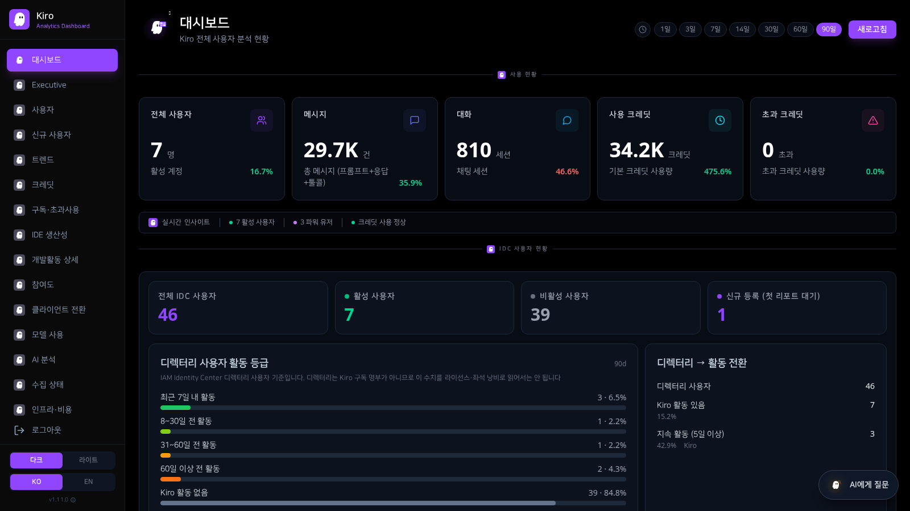
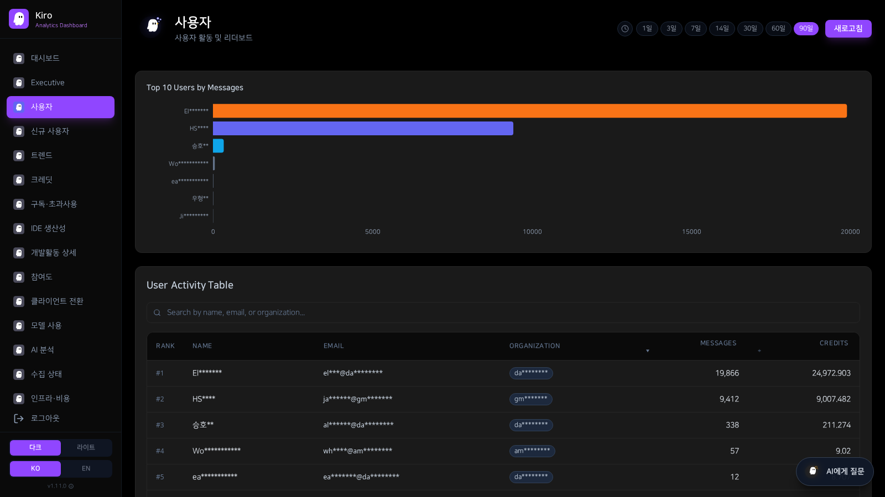
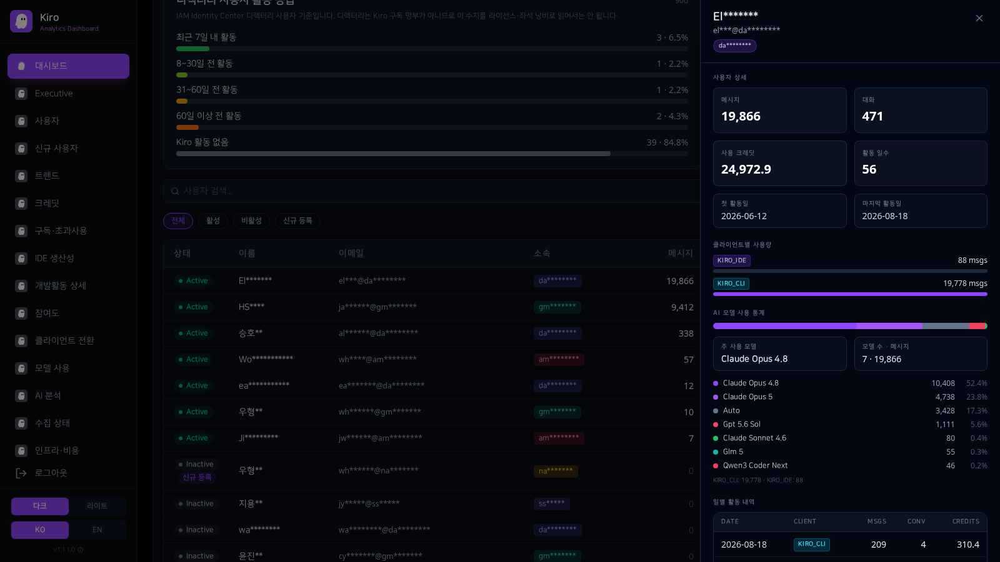
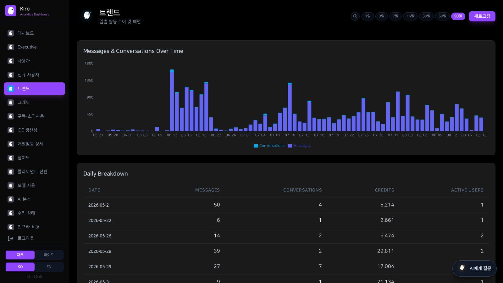
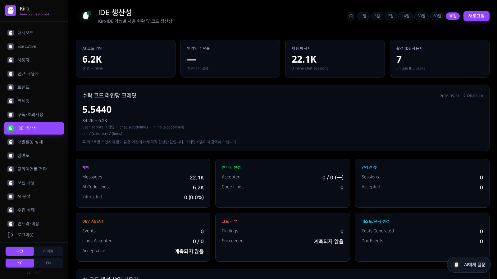
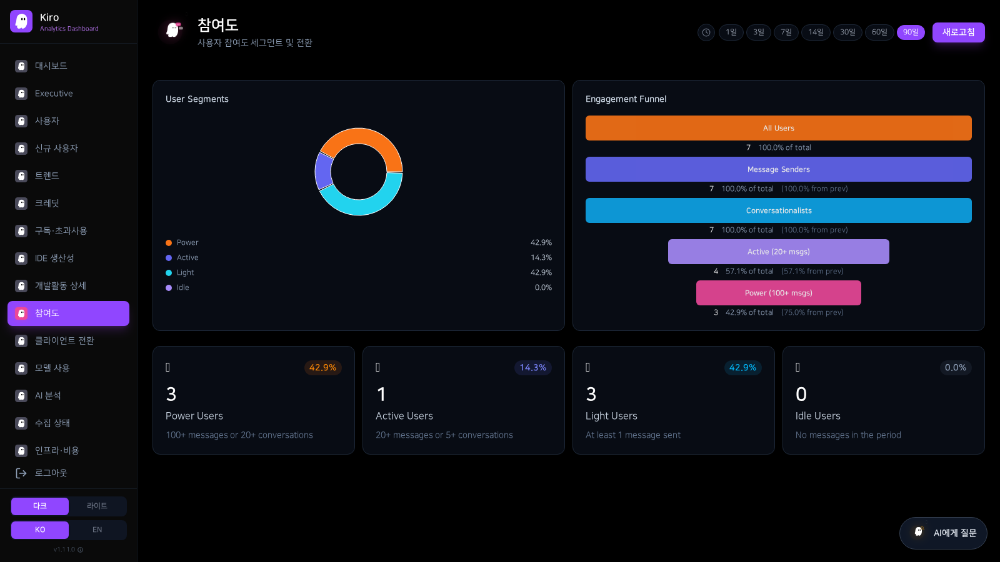
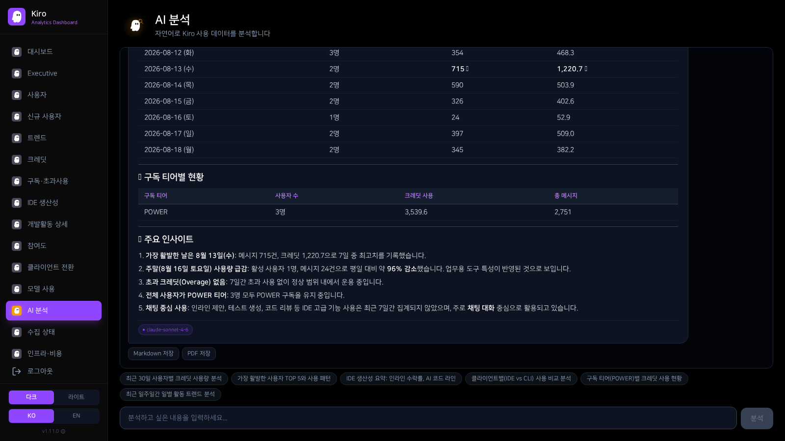

# kiro-dashboard

[](LICENSE)
[]()
[]()
[]()
[](#english)
[](#한국어)

**EN** Kiro IDE user analytics dashboard with AI-powered analysis on AWS
**KR** AWS 기반 AI 분석 기능을 갖춘 Kiro IDE 사용자 분석 대시보드

---

# English

## Overview

kiro-dashboard is a full-stack analytics platform that visualizes Kiro IDE usage data. It queries user activity reports stored in S3 via Athena, renders interactive charts with Recharts, and provides natural language analysis powered by Amazon Bedrock Claude Sonnet 4.6. The dashboard is deployed on ECS Fargate behind CloudFront and ALB with Cognito authentication.

### Dashboard Overview



### User Activity and Leaderboard



### User Detail Drill-down



### Daily Trends



### IDE Productivity Metrics



### Engagement Segmentation



### AI-Powered Natural Language Analysis



## Features

- **Real-time Usage Analytics** — Track users, messages, conversations, credits, and overage across configurable time periods (1 minute to 90 days)
- **IDE Productivity Metrics** — Analyze inline completion rates, AI code lines, chat interactions, dev agent usage, and code review findings from the 46-column legacy report
- **Identity Center Integration** — Map all IdC users to display names, emails, and organizations with active/inactive status tracking
- **AI-Powered Analysis** — Ask natural language questions about Kiro data; Claude Sonnet 4.6 autonomously generates Athena SQL, executes queries, and produces Korean markdown reports
- **User Detail Drill-down** — Click any user row to see daily activity breakdown, client type usage, and conversation history in a slide-in panel
- **Animated Kiro Mascot** — Page-themed Kiro ghost character with eye-blinking, bouncing, and contextual accessories (dashboard grid, trend arrows, code terminal, chat bubbles)
- **Bilingual Interface** — Full Korean/English toggle with sidebar language switcher
- **Lambda@Edge Authentication** — CDN-level Cognito PKCE authentication via Lambda@Edge; no auth logic in the app
- **Data Masking** — Server-side masking of all user identifiers (names, emails, organizations) showing only first 2 characters
- **Model Usage Analysis** — Per-model message distribution (Auto, Claude Opus, Claude Sonnet), daily trends, Auto vs manual selection ratio, and user model preference table via S3 direct CSV parsing
- **Executive Snapshot** — One-page leadership view composing KPI cards, daily active users and credits, model share, tier mix, and top credit users
- **Subscription & Overage Governance** — Tier mix (users/credits/messages per subscription tier), tier credit share, and a per-user overage watchlist tracking `overage_credits_used` against `overage_cap`
- **New Users & Adoption** — Daily new-user inflow (UAR `New_User` flag), active and cumulative user trends, and a recent-new-users table via S3 direct CSV parsing
- **Dev Activity Detail** — TestGen, DocGen, Transform, InlineChat, and CodeFix activity groups from the legacy report: events, generated vs accepted lines, acceptance rates, daily trends
- **Client Rollout & Cross-client Adoption** — Daily and cumulative adoption per `Client_Type` (`KIRO_IDE` / `KIRO_CLI` / `PLUGIN`), IDE↔CLI overlap segments, per-user pickup lag (left-censored users report `null`, never `0`), and a tier × client matrix
- **Ingest Health Monitor** — Report freshness against the 02:00 UTC delivery cadence, a (date × client) delivery matrix, per-file S3 inventory, CSV header-drift detection, and Athena↔S3 row parity — the schema drift `OpenCSVSerDe` hides by silently mapping columns onto wrong names
- **Dormancy Grading & Activation Funnel** — Identity Center directory users bucketed by days since last activity (`active7` → `never`) plus a directory → any-activity → sustained-activity funnel. Graded accounts are **directory users, never licensed seats** — neither report contains a subscription roster
- **Credits per Accepted AI Code Line** — Cross-report efficiency ratio summing `credits_used` and legacy AI-code-line columns independently over their overlapping window, with a separate population `n` per side (an inner join would drop 303 of 541 legacy pairs)
- **Changelog Page** — Bilingual in-app changelog rendered from `CHANGELOG.md` at build time; the sidebar version footer links to it
- **AI Chatbot Widget** — Global floating chat available on every page, backed by the same Bedrock agent as `/analyze`; multi-turn history, stop/new-chat, full-screen sheet on mobile
- **AI Analysis Export** — Save completed AI answers as Markdown or PDF (`html2canvas-pro` + `jspdf`; Korean text and dark-theme tables render intact)
- **Dark / Light Theme** — Sidebar toggle, default dark, persisted in the browser; implemented as a Tailwind palette override so components stay dark-first
- **Mobile Responsive** — Below 768px the sidebar becomes an off-canvas drawer with a hamburger bar and grids/tables reflow; desktop layout unchanged
- **Self-hosted NanumSquare Font** — Bundled as woff2 via `next/font/local`, no runtime CDN dependency behind CloudFront
- **Custom Domain (optional)** — `CUSTOM_DOMAIN` + `CUSTOM_DOMAIN_CERT_ARN` add a CloudFront alias + ACM cert and whitelist it on the Cognito app client

## Prerequisites

- Node.js >= 18
- Docker (for container builds)
- AWS CLI v2 (configured with appropriate credentials)
- AWS CDK CLI (`npm install -g aws-cdk`)
- AWS Account with access to: ECS, ECR, CloudFront, ALB, Athena, Glue, S3, Cognito, IAM Identity Center, Bedrock
- **Kiro IDE "User Activity Report" enabled** for your account — the dashboard queries the CSV files that this report drops into S3. Enable it in the Kiro console (see [Viewing per-user activity](https://kiro.dev/docs/enterprise/monitor-and-track/user-activity/)). Without it the Glue table exists but is empty and every page renders as an empty table.

## Installation

```bash
# Clone the repository
git clone https://github.com/whchoi98/kiro-dashboard.git
cd kiro-dashboard

# Install frontend dependencies
npm install

# Install CDK dependencies
cd infra && npm install && cd ..

# Copy environment file and configure
cp .env.example .env.local
# Edit .env.local with your AWS configuration
```

## Usage

```bash
# Start local development server
npm run dev
# Open http://localhost:3000

# Build for production
npm run build

# Deploy to AWS (first time)
# 1) Copy the deploy-time env template and fill in your values
cp .env.deploy.example .env.deploy
# edit .env.deploy — set CDK_DEFAULT_ACCOUNT, ATHENA_DATA_BUCKET_NAME,
# S3_REPORT_PREFIX, IDENTITY_STORE_ID, ATHENA_RESULTS_BUCKET_NAME, ...
# (every override is documented in .env.deploy.example itself and the
# "Configuration" section below)

# 2) Load it into your shell, then deploy
set -a; source .env.deploy; set +a
cd infra
npx cdk bootstrap
npx cdk deploy --all
# Setting ATHENA_DATA_BUCKET_NAME also triggers the opt-in
# `KiroDashboardCatalog` stack which registers the `user_report` and
# legacy `by_user_analytic` Glue tables over your S3 prefixes — a fresh
# account now boots without a manual Glue crawler. `.env.deploy` is
# git-ignored so your account values never get committed.

# Build and push Docker image
docker build -t kiro-dashboard .
aws ecr get-login-password --region ap-northeast-2 | \
  docker login --username AWS --password-stdin <account>.dkr.ecr.ap-northeast-2.amazonaws.com
docker tag kiro-dashboard:latest <account>.dkr.ecr.ap-northeast-2.amazonaws.com/kiro-dashboard:latest
docker push <account>.dkr.ecr.ap-northeast-2.amazonaws.com/kiro-dashboard:latest

# Force ECS service update
aws ecs update-service --cluster kiro-dashboard-cluster \
  --service <service-name> --force-new-deployment
```

## Upgrading

Read the target version's `### Upgrading from <prev>` block in
[CHANGELOG.md](CHANGELOG.md) before deploying — it states which of the two
paths below applies and lists anything that needs migrating.

**The decision that matters is: does this release change `infra/`?** Let
`cdk diff` answer it, never the file list:

```bash
git pull
set -a; source .env.deploy; set +a
# CDK derives its region from the credential chain, so AWS_REGION in your
# shell silently overrides CDK_DEFAULT_REGION. Pin both.
export AWS_REGION=$CDK_DEFAULT_REGION AWS_DEFAULT_REGION=$CDK_DEFAULT_REGION
cd infra && npx cdk diff --all
```

- **Network and Security report "no differences", and the only Ecs/Cdn delta is
  the `X-Custom-Secret` value** → app-only release. Take the image path
  (`docker build` → ECR push → `update-service --force-new-deployment`). That
  secret is regenerated by `crypto.randomUUID()` on every synth, so it is
  *always* different and is not evidence of a real change. Running `cdk deploy`
  anyway just rotates it.
- **Anything else differs** → infra release. Push the new image first, then
  `npx cdk deploy --all` in a **single** command so `KiroDashboardEcs` and
  `KiroDashboardCdn` receive the same secret from one synth. Deploying Ecs
  alone answers every request with 403 until Cdn catches up.

Tag each image with its version as well as `latest`, so a rollback has a named
target. Full procedure, traps, and verification steps:
[`docs/runbooks/production-deploy.md`](docs/runbooks/production-deploy.md).

**v1.5.0 → v1.6.1 is app-only** — no new dependencies, ECS environment
variables, IAM permissions, or CloudFront behaviours. See the changelog's
[Upgrading from 1.5.0](CHANGELOG.md#upgrading-from-150) block for the verified
details and the two notes that matter to forks. Go to 1.6.1, not 1.6.0: 1.6.0
built `/changelog` as an empty page because `.dockerignore` kept
`CHANGELOG.md` out of the build context.

## Configuration

### Runtime container env (ECS task)

These values end up on the Fargate container via `EcsStack`. Maintainer
defaults are baked in; forks override them by exporting the CDK-time env
vars listed in the next table before running `npx cdk deploy`.

| Container variable | Description | Default |
|----------|-------------|---------|
| `AWS_REGION` | AWS region for Athena/Glue/Identity Store | `us-east-1` |
| `ATHENA_DATABASE` | Glue database name | `titanlog` |
| `ATHENA_OUTPUT_BUCKET` | S3 path for Athena query results | `s3://whchoi01-titan-q-log/athena-results/` |
| `GLUE_TABLE_NAME` | Primary Glue table name | `user_report` |
| `IDENTITY_STORE_ID` | IAM Identity Center store ID | `d-90663be888` |
| `S3_REPORT_PREFIX` | S3 prefix for user_report CSV files | `q-user-log/AWSLogs/<deploy-account>/KiroLogs/user_report/us-east-1/` (account-derived) |
| `S3_DATA_BUCKET` | UAR data bucket for `/api/model-usage` | only set when `ATHENA_DATA_BUCKET_NAME` is configured (two-bucket setups) |

### CDK-time overrides (read by `infra/bin/app.ts`)

Export these before `npx cdk deploy` to point the stack at your own
account. Omit them to keep the upstream maintainer defaults.

| CDK env | Overrides | Also used by |
|---------|-----------|--------------|
| `ATHENA_DATA_BUCKET_NAME` | S3 bucket holding Kiro User Activity Report CSV files | Enables the opt-in `KiroDashboardCatalog` stack |
| `ATHENA_RESULTS_BUCKET_NAME` | Bucket that Athena writes query results into | — |
| `ATHENA_RESULTS_PREFIX` | Prefix within the results bucket | — |
| `ATHENA_DATABASE_NAME` | Glue database name | `KiroDashboardCatalog` |
| `GLUE_TABLE_NAME_OVERRIDE` | Glue table name | `KiroDashboardCatalog` |
| `S3_REPORT_PREFIX` | S3 prefix under the data bucket | `KiroDashboardCatalog` |
| `BY_USER_ANALYTIC_PREFIX` | Prefix of the legacy `by_user_analytic` report (default: derived from `S3_REPORT_PREFIX`) | `KiroDashboardCatalog` |
| `IDENTITY_STORE_ID` | IAM Identity Center store ID | — |
| `EXISTING_VPC_ID` | Reuse an existing VPC instead of creating a fresh one | `KiroDashboardNetwork` |
| `VPC_CIDR` | CIDR block used when creating a new VPC | `KiroDashboardNetwork` |

> **⚠ Redeploying an existing environment?** Deployments created before the
> VPC default changed (including the upstream maintainer environment, which
> imported an existing VPC via `cdk.json`) **must** set `EXISTING_VPC_ID` to
> their current VPC id. Without it, `cdk deploy` now synthesizes a brand-new
> VPC and forces replacement of the ALB/ECS/CloudFront resources attached to
> the old one. `NetworkStack` prints a synth-time warning whenever it is
> about to create a new VPC.

When `ATHENA_DATA_BUCKET_NAME` is set, a 6th CDK stack —
`KiroDashboardCatalog` — is instantiated. It creates the Glue database,
the `user_report` external table (11 fixed columns), and the legacy
`by_user_analytic` table (46 columns, feeds `/productivity`), all
documented in `docs/kiro-user-activity-report-schema.md`. The
`by_user_analytic` S3 prefix is derived by swapping the `user_report`
path segment in `S3_REPORT_PREFIX`, or set explicitly via
`BY_USER_ANALYTIC_PREFIX`. If you'd rather manage the catalog outside
CDK, the `user_report` DDL lives in `infra/sql/user-report-table.sql`
(substitute `<DATA_BUCKET>` / `<REPORT_PREFIX>` and run in Athena).

### Empty-state behaviour

Until the first User Activity Report CSV lands in your S3 prefix, every
page renders as an **empty table** instead of a 500 error page. Routes
detect the underlying "missing table / empty data" signal and return a
200 with a well-shaped empty payload.

## Project Structure

```
app/                        Next.js App Router
  api/                      17 API routes
    analyze/                Bedrock AI analysis (SSE streaming)
    metrics/                KPI aggregations
    users/                  User rankings with IdC details
    trends/                 Daily activity trends
    credits/                Credit usage analysis
    engagement/             User segmentation and funnel
    productivity/           IDE productivity metrics
    subscription/           Tier mix + overage governance
    adoption/               New-user inflow (S3 direct read)
    dev-activity/           Legacy deep dev metrics
    rollout/                Client rollout & IDE↔CLI overlap
    ingest-health/          Report delivery, freshness, header drift (S3 + Athena)
    idc-users/              Identity Center user status + dormancy grading, funnel
    user-detail/            Per-user activity drill-down
    client-dist/            Client type distribution
    model-usage/            AI model usage analysis (S3 direct read)
    health/                 ECS health check
  components/               Shared React components
    layout/                 Sidebar (drawer + theme/lang toggles), Header, KiroLogo
    chat/                   FloatingChat, ChatPanel, MessageList, ChatComposer, ChatMarkdown
    charts/                 MetricCard, TrendChart, PieChart, BarChart, FunnelChart, IdcUserStatus
    tables/                 UserTable (sortable, searchable)
    ui/                     KiroIcon, KiroMascot, DateRangePicker, UserDetailPanel
  analyze/                  AI analysis chat page
  users/                    User activity page
  credits/                  Credit usage page
  trends/                   Activity trends page
  engagement/               Engagement metrics page
  productivity/             IDE productivity page
  model-usage/              AI model usage analysis page
  exec/                     Executive one-page snapshot
  subscription/             Subscription & overage governance page
  adoption/                 New users & adoption page
  dev-activity/             Dev activity detail page
  rollout/                  Client rollout & cross-client adoption page
  ingest-health/            Report delivery & freshness monitor
  changelog/                Bilingual changelog page (build-time static)
lib/                        Shared libraries
  athena.ts                 Athena query client + NORMALIZE_USERID
  glue.ts                   Glue table resolver
  identity.ts               Identity Center user resolver (with masking)
  mask.ts                   Data masking utilities
  i18n.tsx                  Korean/English i18n context
  theme.tsx                 Dark/light theme context (localStorage, .light class)
  chart-theme.ts            Theme-aware Recharts colors (tick/tooltip/cursor)
  uar-s3.ts                 UAR S3 helpers (month-prefix parallel listing, CSV parsing)
  useChatStream.ts          Chat hook against /api/analyze SSE agent (shared by /analyze + widget)
  chat-scroll.ts            Stick-to-bottom helper for streaming chat
  export-report.ts          Markdown/PDF exporters for AI answers
  version.ts                APP_VERSION single source (from package.json)
app/fonts/                  Self-hosted NanumSquare woff2 (next/font/local)
types/                      TypeScript interfaces
  dashboard.ts              All data model types
infra/                      AWS CDK infrastructure
  bin/app.ts                CDK app entry (6 stacks incl. opt-in Catalog)
  lib/network-stack.ts      VPC (new or existing mgmt-vpc)
  lib/security-stack.ts     Security groups, Cognito, EdgeAuthClient
  lib/ecs-stack.ts          ECS Fargate, ALB, ECR, IAM, Auto Scaling
  lib/cdn-stack.ts          CloudFront + Lambda@Edge + SSM config
  lambda/edge-auth/         Lambda@Edge Cognito auth (PKCE + JWT)
public/                     Static assets
  kiro-logo.svg             Kiro ghost character SVG
docs/                       Architecture, ADRs, specs
```

## Testing

```bash
# Run project structure tests
bash tests/run-all.sh

# Verify Next.js build
npm run build

# Verify CDK synthesis
cd infra && npx cdk synth --all

# Test Docker build
docker build -t kiro-dashboard .

# Test health endpoint
curl http://localhost:3000/api/health
```

## Reference Documentation

### Upstream Kiro documentation (primary reference)

Every data source this dashboard reads is defined by the official Kiro enterprise docs below. They are the authority on column names, delivery cadence, and S3 layout — when this repo's docs disagree with them, these win.

| Document | Why it matters here |
|----------|--------------------|
| [Kiro IDE — Viewing per-user activity](https://kiro.dev/docs/enterprise/monitor-and-track/user-activity/) | Defines the `user_report` and legacy `by_user_analytic` CSV reports, all metric columns, the required S3 bucket policy, and the `AWSLogs/<account>/KiroLogs/...` path layout the dashboard queries |
| [Kiro CLI — View per-user activity](https://kiro.dev/docs/cli/enterprise/monitor-and-track/user-activity/) | Same reporting feature from the CLI side; confirms one CSV per `Client_Type` (`KIRO_IDE`, `KIRO_CLI`, `PLUGIN`) and that the legacy report covers CLI/plugin usage |
| [Kiro CLI — Log user prompts](https://kiro.dev/docs/cli/enterprise/monitor-and-track/prompt-logging/) | Prompt logging: opt-in delivery of raw prompts and responses as JSON to a **separate** S3 bucket. **Already enabled in this account but not consumed by the dashboard** — observed key layout and roadmap notes in `docs/kiro-user-activity-report-schema.md` |
| [Kiro CLI — Viewing Kiro usage on the dashboard](https://kiro.dev/docs/cli/enterprise/monitor-and-track/dashboard/) | The built-in Kiro console dashboard. Useful as a baseline: it is aggregate-only (no per-user detail), which is the gap this project fills — and it is the only doc defining Active vs **Pending** (uncharged) subscriptions |

Key operational facts drawn from those pages:

- Reports are generated **once per day at 02:00 UTC**, one CSV per client type. The first file appears at the next 02:00 UTC after enablement, so expect up to ~24h before any data lands.
- If more than **1,000 users** are active in a day, Kiro splits the CSV into `part_1`, `part_2`, … files for that date. Never yet observed here — all 214 `user_report` objects are unsplit, and because no manifest of the expected part count exists, a missing `part_N` file is not detectable.
- The `00` segment in the S3 path is a fixed hour partition reflecting the 02:00 UTC write time. Prompt logs use a *real* `HH` partition instead, so do not assume `00` outside the activity-report prefixes.
- Model message columns are **dynamic** — lowercase model names in alphabetical order starting with Auto — so the column set changes between files. This is why `/api/model-usage` and `/api/adoption` parse CSV by header name instead of going through Athena (see `docs/decisions/ADR-0004-s3-direct-read-for-positional-columns.md`). `/api/ingest-health` reads the same listing to surface this drift directly — per-file header *sets* and object metadata, which Athena cannot see at all because `OpenCSVSerDe` silently maps drifted columns onto the wrong names.
- Cross-account report delivery is **not supported**; the bucket must be in the same account and Region as the Kiro profile.
- Neither report contains a **subscription roster**. Total/Active/Pending seat counts come from `user-subscriptions:ListUserSubscriptions` (Kiro console only; never called by this repo), so IAM Identity Center `ListUsers` is a workforce directory and must never be labelled "licensed seats".

### Project documentation

- `docs/kiro-user-activity-report-schema.md` — full column reference for both reports, annotated with which API route consumes each column
- `docs/architecture.md` — system overview, CDK stack composition, data flow
- `docs/onboarding.md` — new-contributor setup walkthrough
- `docs/decisions/` — ADR-0001 … ADR-0006, the recorded design decisions
- `docs/runbooks/` — operational procedures for Athena, auth, ECS, and S3 direct-read failures

## Contributing

1. Fork the repository
2. Create a feature branch (`git checkout -b feat/add-new-chart`)
3. Commit changes (`git commit -m 'feat: add new chart component'`)
4. Push to the branch (`git push origin feat/add-new-chart`)
5. Open a Pull Request

Follow [Conventional Commits](https://www.conventionalcommits.org/) format:
- `feat:` new feature
- `fix:` bug fix
- `docs:` documentation
- `chore:` maintenance

## License

This project is licensed under the MIT License. See the [LICENSE](LICENSE) file for details.

## Contact

- Maintainer: WooHyung Choi / [whchoi98](https://github.com/whchoi98)
- Issues: [GitHub Issues](https://github.com/whchoi98/kiro-dashboard/issues)

---

# 한국어

## 개요

kiro-dashboard는 Kiro IDE 사용 데이터를 시각화하는 풀스택 분석 플랫폼입니다. S3에 저장된 사용자 활동 리포트를 Athena로 쿼리하고, Recharts로 인터랙티브 차트를 렌더링하며, Amazon Bedrock Claude Sonnet 4.6으로 자연어 분석 기능을 제공합니다. 대시보드는 CloudFront와 ALB 뒤의 ECS Fargate에 배포되며, Cognito 인증을 사용합니다.

### 대시보드 개요


### 사용자 활동 및 리더보드


### 사용자 상세 드릴다운


### 일별 트렌드


### IDE 생산성 메트릭


### 참여도 세그먼트


### AI 기반 자연어 분석


## 주요 기능

- **실시간 사용 분석** — 사용자, 메시지, 대화, 크레딧, 초과 크레딧을 1분~90일 범위로 추적합니다
- **IDE 생산성 메트릭** — 46개 컬럼 레거시 리포트에서 인라인 수락률, AI 코드 라인, 채팅, Dev Agent, 코드 리뷰를 분석합니다
- **Identity Center 통합** — 모든 IdC 사용자를 이름, 이메일, 소속으로 매핑하고 활성/비활성 상태를 추적합니다
- **AI 기반 분석** — Kiro 데이터에 대한 자연어 질문을 처리합니다. Claude Sonnet 4.6이 Athena SQL을 자율 생성하고 실행하여 한국어 마크다운 리포트를 생성합니다
- **사용자 상세 드릴다운** — 사용자 행 클릭 시 일별 활동 내역, 클라이언트 유형별 사용량, 대화 이력을 슬라이드 패널로 확인합니다
- **애니메이션 Kiro 마스코트** — 페이지별 테마에 맞는 Kiro 유령 캐릭터가 눈 깜빡임, 바운스, 상황별 액세서리(대시보드 그리드, 트렌드 화살표, 코드 터미널, 채팅 말풍선)를 표시합니다
- **이중 언어 인터페이스** — 사이드바 언어 전환기를 통한 한국어/영어 완전 지원
- **Lambda@Edge 인증** — CDN 레벨 Cognito PKCE 인증 (Lambda@Edge), 앱 내 인증 로직 없음
- **데이터 마스킹** — 모든 사용자 식별자(이름, 이메일, 소속)를 서버 측에서 마스킹하여 첫 2글자만 표시
- **모델 사용 분석** — 모델별 메시지 분포(Auto, Claude Opus, Claude Sonnet), 일별 트렌드, Auto vs 수동 선택 비율, 사용자별 모델 선호도 테이블 (S3 CSV 직접 파싱)
- **Executive 스냅샷** — KPI 카드, 일별 활성 사용자·크레딧, 모델 점유율, 티어 구성, 상위 크레딧 사용자를 한 페이지로 구성한 경영진용 뷰
- **구독·초과사용 거버넌스** — 구독 티어 구성(티어별 사용자/크레딧/메시지), 티어 크레딧 점유율, `overage_cap` 대비 `overage_credits_used`를 추적하는 사용자별 초과사용 워치리스트
- **신규 사용자·온보딩** — 일별 신규 사용자 유입(UAR `New_User` 플래그), 활성·누적 사용자 추이, 최근 신규 사용자 테이블 (S3 CSV 직접 파싱)
- **개발활동 상세** — 레거시 리포트의 TestGen, DocGen, Transform, InlineChat, CodeFix 그룹: 이벤트, 생성 대비 수락 라인, 수락률, 일별 추이
- **클라이언트 확산·교차 사용** — `Client_Type`(`KIRO_IDE` / `KIRO_CLI` / `PLUGIN`)별 일별·누적 확산, IDE↔CLI 중복 세그먼트, 사용자별 도입 지연(윈도우 경계에서 좌측 절단된 사용자는 `0`이 아니라 `null`), 티어 × 클라이언트 매트릭스
- **적재 상태 모니터** — 02:00 UTC 전송 주기 대비 신선도, (날짜 × 클라이언트) 전송 매트릭스, 파일별 S3 인벤토리, CSV 헤더 드리프트 감지, Athena↔S3 행 수 일치 검증 — `OpenCSVSerDe`가 드리프트된 컬럼을 잘못된 이름에 조용히 매핑해 감추는 문제를 드러냅니다
- **휴면 등급·활성화 퍼널** — Identity Center 디렉터리 사용자를 마지막 활동 경과일 기준으로 분류(`active7` → `never`)하고, 디렉터리 → 활동 있음 → 지속 활동 퍼널을 제공합니다. 등급이 매겨지는 대상은 **디렉터리 사용자이며 라이선스 좌석이 아닙니다** — 두 리포트 모두 구독 명부를 포함하지 않습니다
- **수락 AI 코드 라인당 크레딧** — `credits_used`와 레거시 AI 코드 라인 컬럼을 공통 기간에 대해 각각 독립 합산한 리포트 간 효율 지표. 항별 모집단 `n`을 따로 표기합니다(내부 조인 시 레거시 541쌍 중 303쌍이 유실)
- **Changelog 페이지** — 빌드 타임에 `CHANGELOG.md`를 렌더링하는 앱 내 이중언어 변경 이력, 사이드바 버전 표기에서 연결
- **AI 챗봇 위젯** — 모든 페이지에 뜨는 플로팅 대화창, `/analyze`와 동일한 Bedrock 에이전트 기반. 멀티턴 이력, 중지/새 대화, 모바일 풀스크린 시트
- **AI 분석 내보내기** — 완료된 AI 답변을 Markdown 또는 PDF로 저장(`html2canvas-pro` + `jspdf`, 한국어·다크 테마 표 온전히 렌더링)
- **다크 / 라이트 테마** — 사이드바 토글, 기본 다크, 브라우저에 저장. Tailwind 팔레트 오버라이드 방식이라 컴포넌트는 다크 기준 유지
- **모바일 반응형** — 768px 미만에서 사이드바가 햄버거 바 + 오프캔버스 드로어로 전환, 그리드·표 재배치. 데스크톱 레이아웃은 무변경
- **나눔스퀘어 서체 셀프호스팅** — woff2를 `next/font/local`로 번들, CloudFront 뒤에서 CDN 런타임 의존 없음
- **커스텀 도메인 (선택)** — `CUSTOM_DOMAIN` + `CUSTOM_DOMAIN_CERT_ARN`으로 CloudFront 별칭 + ACM 인증서 추가 및 Cognito 앱 클라이언트 허용 목록 등록

## 사전 요구 사항

- Node.js >= 18
- Docker (컨테이너 빌드용)
- AWS CLI v2 (적절한 자격 증명으로 설정)
- AWS CDK CLI (`npm install -g aws-cdk`)
- AWS 계정: ECS, ECR, CloudFront, ALB, Athena, Glue, S3, Cognito, IAM Identity Center, Bedrock 접근 권한 필요
- **Kiro IDE "User Activity Report" 활성화 필요** — 대시보드는 이 리포트가 S3에 떨어뜨리는 CSV 파일을 조회합니다. Kiro 콘솔에서 활성화하세요 ([Viewing per-user activity](https://kiro.dev/docs/enterprise/monitor-and-track/user-activity/)). 활성화 전에는 Glue 테이블은 존재해도 데이터가 없어 모든 페이지가 빈 표로 렌더링됩니다.

## 설치 방법

```bash
# 저장소 복제
git clone https://github.com/whchoi98/kiro-dashboard.git
cd kiro-dashboard

# 프론트엔드 의존성 설치
npm install

# CDK 의존성 설치
cd infra && npm install && cd ..

# 환경 파일 복사 및 설정
cp .env.example .env.local
# .env.local을 AWS 설정에 맞게 편집합니다
```

## 사용법

```bash
# 로컬 개발 서버 시작
npm run dev
# http://localhost:3000 접속

# 프로덕션 빌드
npm run build

# AWS에 배포 (최초)
# 1) 배포용 환경 템플릿을 복사하고 값을 채웁니다
cp .env.deploy.example .env.deploy
# .env.deploy 편집 — CDK_DEFAULT_ACCOUNT, ATHENA_DATA_BUCKET_NAME,
# S3_REPORT_PREFIX, IDENTITY_STORE_ID, ATHENA_RESULTS_BUCKET_NAME 등
# (모든 오버라이드는 .env.deploy.example 파일과 아래 "환경 설정"
# 섹션에 문서화되어 있음)

# 2) 셸에 로드한 뒤 배포
set -a; source .env.deploy; set +a
cd infra
npx cdk bootstrap
npx cdk deploy --all
# `ATHENA_DATA_BUCKET_NAME`을 설정하면 옵트-인 스택인
# `KiroDashboardCatalog`도 생성되어 `user_report`와 레거시
# `by_user_analytic` Glue 테이블이 자신의 S3 프리픽스 위에 등록됩니다.
# 별도 Glue 크롤러 없이 바로 동작합니다. `.env.deploy`는 git 추적에서
# 제외되므로 계정별 값이 커밋되지 않습니다.

# Docker 이미지 빌드 및 푸시
docker build -t kiro-dashboard .
aws ecr get-login-password --region ap-northeast-2 | \
  docker login --username AWS --password-stdin <계정>.dkr.ecr.ap-northeast-2.amazonaws.com
docker tag kiro-dashboard:latest <계정>.dkr.ecr.ap-northeast-2.amazonaws.com/kiro-dashboard:latest
docker push <계정>.dkr.ecr.ap-northeast-2.amazonaws.com/kiro-dashboard:latest

# ECS 서비스 강제 업데이트
aws ecs update-service --cluster kiro-dashboard-cluster \
  --service <서비스명> --force-new-deployment
```

## 업그레이드

배포 전에 [CHANGELOG.md](CHANGELOG.md)에서 대상 버전의
`### 1.5.0에서 업그레이드하기`(해당 버전의 업그레이드 절) 항목을 먼저 읽으세요.
아래 두 경로 중 어느 것에 해당하는지와 마이그레이션이 필요한 항목이 적혀 있습니다.

**핵심 판단 기준은 "이 릴리스가 `infra/`를 변경하는가"입니다.** 변경된 파일
목록이 아니라 `cdk diff`로 판단하세요.

```bash
git pull
set -a; source .env.deploy; set +a
# CDK는 자격증명 체인에서 리전을 도출하므로, 셸의 AWS_REGION이
# CDK_DEFAULT_REGION을 조용히 덮어씁니다. 둘 다 고정하세요.
export AWS_REGION=$CDK_DEFAULT_REGION AWS_DEFAULT_REGION=$CDK_DEFAULT_REGION
cd infra && npx cdk diff --all
```

- **Network·Security가 "no differences"이고 Ecs/Cdn의 차이가
  `X-Custom-Secret` 값뿐이면** → 앱 전용 릴리스입니다. 이미지 경로를
  사용하세요(`docker build` → ECR 푸시 →
  `update-service --force-new-deployment`). 이 시크릿은 매 synth마다
  `crypto.randomUUID()`로 새로 생성되므로 *항상* 달라지며 실제 변경의 증거가
  아닙니다. 그래도 `cdk deploy`를 실행하면 시크릿만 회전됩니다.
- **그 외 차이가 있으면** → 인프라 릴리스입니다. 새 이미지를 먼저 푸시한 뒤
  `npx cdk deploy --all`을 **한 번의 명령**으로 실행해 `KiroDashboardEcs`와
  `KiroDashboardCdn`이 동일한 synth의 같은 시크릿을 받도록 하세요. Ecs만
  배포하면 Cdn이 따라올 때까지 모든 요청이 403이 됩니다.

각 이미지에는 `latest`뿐 아니라 버전 태그도 함께 붙이세요. 롤백 대상 이름이
남습니다. 전체 절차·함정·검증 단계는
[`docs/runbooks/production-deploy.md`](docs/runbooks/production-deploy.md)에
있습니다.

**v1.5.0 → v1.6.1은 앱 전용입니다** — 새 의존성, ECS 환경변수, IAM 권한,
CloudFront 동작 추가가 모두 없습니다. 검증된 상세 내용과 포크에 해당되는 두 가지
주의사항은 CHANGELOG의 [1.5.0에서 업그레이드하기](CHANGELOG.md#150에서-업그레이드하기)
절을 참고하세요. 1.6.0이 아니라 1.6.1로 올라가세요. 1.6.0은 `.dockerignore`가
`CHANGELOG.md`를 빌드 컨텍스트에서 제외해 `/changelog`가 빈 페이지로
빌드됩니다.

## 환경 설정

### 런타임 컨테이너 환경 변수 (ECS task)

이 값들은 `EcsStack`을 통해 Fargate 컨테이너에 주입됩니다. 메인테이너
기본값이 내장되어 있으며, 포크는 아래 "CDK 배포 시 오버라이드" 섹션의
환경 변수를 `npx cdk deploy` 실행 전에 export하여 덮어씁니다.

| 컨테이너 변수 | 설명 | 기본값 |
|--------|------|--------|
| `AWS_REGION` | Athena/Glue/Identity Store AWS 리전 | `us-east-1` |
| `ATHENA_DATABASE` | Glue 데이터베이스 이름 | `titanlog` |
| `ATHENA_OUTPUT_BUCKET` | Athena 쿼리 결과 S3 경로 | `s3://whchoi01-titan-q-log/athena-results/` |
| `GLUE_TABLE_NAME` | 기본 Glue 테이블 이름 | `user_report` |
| `IDENTITY_STORE_ID` | IAM Identity Center 스토어 ID | `d-90663be888` |
| `S3_REPORT_PREFIX` | user_report CSV 파일 S3 경로 프리픽스 | `q-user-log/AWSLogs/<배포 계정>/KiroLogs/user_report/us-east-1/` (계정에서 자동 유도) |
| `S3_DATA_BUCKET` | `/api/model-usage`가 읽는 UAR 데이터 버킷 | `ATHENA_DATA_BUCKET_NAME` 설정 시에만 주입 (버킷 분리 구성용) |

### CDK 배포 시 오버라이드 (`infra/bin/app.ts`가 읽음)

자신의 계정을 대상으로 배포할 때 다음 변수를 `npx cdk deploy` 전에
export 하세요. 지정하지 않으면 업스트림 메인테이너 기본값이 유지됩니다.

| CDK 환경 변수 | 덮어쓰는 대상 | 추가 효과 |
|---------|-----------|--------------|
| `ATHENA_DATA_BUCKET_NAME` | Kiro User Activity Report CSV가 있는 S3 버킷 | 옵트-인 스택 `KiroDashboardCatalog` 활성화 |
| `ATHENA_RESULTS_BUCKET_NAME` | Athena가 쿼리 결과를 쓰는 버킷 | — |
| `ATHENA_RESULTS_PREFIX` | 결과 버킷 내 프리픽스 | — |
| `ATHENA_DATABASE_NAME` | Glue 데이터베이스 이름 | `KiroDashboardCatalog` |
| `GLUE_TABLE_NAME_OVERRIDE` | Glue 테이블 이름 | `KiroDashboardCatalog` |
| `S3_REPORT_PREFIX` | 데이터 버킷 내 프리픽스 | `KiroDashboardCatalog` |
| `BY_USER_ANALYTIC_PREFIX` | 레거시 `by_user_analytic` 리포트 프리픽스 (기본: `S3_REPORT_PREFIX`에서 유도) | `KiroDashboardCatalog` |
| `IDENTITY_STORE_ID` | IAM Identity Center 스토어 ID | — |
| `EXISTING_VPC_ID` | 새 VPC를 만들지 않고 기존 VPC를 재사용할 때 지정 | `KiroDashboardNetwork` |
| `VPC_CIDR` | 새 VPC 생성 시 사용할 CIDR 블록 | `KiroDashboardNetwork` |

> **⚠ 기존 환경을 재배포하나요?** VPC 기본값이 바뀌기 전에 배포된 환경
> (`cdk.json`으로 기존 VPC를 가져오던 업스트림 메인테이너 환경 포함)은
> **반드시** `EXISTING_VPC_ID`에 현재 VPC id를 설정해야 합니다. 설정하지
> 않으면 `cdk deploy`가 새 VPC를 합성해 기존 VPC에 붙어 있던
> ALB/ECS/CloudFront 리소스의 교체를 강제합니다. `NetworkStack`은 새 VPC를
> 만들기 직전 synth 단계에서 경고를 출력합니다.

`ATHENA_DATA_BUCKET_NAME`을 설정하면 6번째 CDK 스택인
`KiroDashboardCatalog`가 인스턴스화됩니다. 이 스택은
`docs/kiro-user-activity-report-schema.md`에 정의된 스키마대로 Glue
데이터베이스, `user_report` 외부 테이블(고정 11컬럼), 그리고
`/productivity`가 사용하는 레거시 `by_user_analytic` 테이블(46컬럼)을
생성합니다. `by_user_analytic` 프리픽스는 `S3_REPORT_PREFIX`의
`user_report` 경로 세그먼트를 치환해 유도하며, `BY_USER_ANALYTIC_PREFIX`로
직접 지정할 수도 있습니다. 카탈로그를 CDK 바깥에서 관리하고 싶다면
`user_report` DDL이 `infra/sql/user-report-table.sql`에 있으니
`<DATA_BUCKET>` / `<REPORT_PREFIX>`를 치환해 Athena에서 직접 실행하면
됩니다.

### 데이터 없음(empty-state) 동작

User Activity Report CSV가 S3에 도착하기 전까지는 500 에러 페이지 대신
각 페이지가 **빈 표**로 렌더링됩니다. API 라우트가 "테이블 없음 / 데이터
없음" 시그널을 감지해 200 + 올바른 shape의 빈 payload를 반환합니다.

## 프로젝트 구조

```
app/                        Next.js App Router
  api/                      17개 API 라우트
    analyze/                Bedrock AI 분석 (SSE 스트리밍)
    metrics/                KPI 집계
    users/                  IdC 정보 포함 사용자 순위
    trends/                 일별 활동 추이
    credits/                크레딧 사용 분석
    engagement/             사용자 세그먼트 및 퍼널
    productivity/           IDE 생산성 메트릭
    subscription/           티어 구성 + 초과사용 거버넌스
    adoption/               신규 사용자 유입 (S3 직접 읽기)
    dev-activity/           레거시 개발활동 상세 메트릭
    rollout/                클라이언트 확산 및 IDE↔CLI 교차 사용
    ingest-health/          리포트 전송·신선도·헤더 드리프트 (S3 + Athena)
    idc-users/              Identity Center 사용자 상태 + 휴면 등급, 퍼널
    user-detail/            개별 사용자 활동 드릴다운
    client-dist/            클라이언트 유형별 분포
    model-usage/            AI 모델 사용 분석 (S3 직접 읽기)
    health/                 ECS 헬스 체크
  components/               공유 React 컴포넌트
    layout/                 사이드바 (드로어 + 테마/언어 토글), 헤더, Kiro 로고
    chat/                   FloatingChat, ChatPanel, MessageList, ChatComposer, ChatMarkdown
    charts/                 MetricCard, TrendChart, PieChart, BarChart, FunnelChart, IdcUserStatus
    tables/                 UserTable (정렬, 검색 가능)
    ui/                     KiroIcon, KiroMascot, DateRangePicker, UserDetailPanel
  analyze/                  AI 분석 채팅 페이지
  users/                    사용자 활동 페이지
  credits/                  크레딧 사용 페이지
  trends/                   활동 트렌드 페이지
  engagement/               참여도 메트릭 페이지
  productivity/             IDE 생산성 페이지
  model-usage/              AI 모델 사용 분석 페이지
  exec/                     Executive 원페이지 스냅샷
  subscription/             구독·초과사용 거버넌스 페이지
  adoption/                 신규 사용자·온보딩 페이지
  dev-activity/             개발활동 상세 페이지
  rollout/                  클라이언트 확산·교차 사용 페이지
  ingest-health/            리포트 전송·신선도 모니터 페이지
  changelog/                이중언어 변경 이력 페이지 (빌드 타임 정적)
lib/                        공유 라이브러리
  athena.ts                 Athena 쿼리 클라이언트 + NORMALIZE_USERID
  glue.ts                   Glue 테이블 리졸버
  identity.ts               Identity Center 사용자 리졸버 (마스킹 포함)
  mask.ts                   데이터 마스킹 유틸리티
  i18n.tsx                  한국어/영어 i18n 컨텍스트
  theme.tsx                 다크/라이트 테마 컨텍스트 (localStorage, .light 클래스)
  chart-theme.ts            테마 대응 Recharts 색상 (눈금/툴팁/커서)
  uar-s3.ts                 UAR S3 헬퍼 (월 프리픽스 병렬 리스팅, CSV 파싱)
  useChatStream.ts          /api/analyze SSE 에이전트 채팅 훅 (/analyze + 위젯 공유)
  chat-scroll.ts            스트리밍 채팅 stick-to-bottom 헬퍼
  export-report.ts          AI 답변 Markdown/PDF 내보내기
  version.ts                APP_VERSION 단일 소스 (package.json 기준)
app/fonts/                  셀프호스팅 나눔스퀘어 woff2 (next/font/local)
types/                      TypeScript 인터페이스
  dashboard.ts              전체 데이터 모델 타입
infra/                      AWS CDK 인프라
  bin/app.ts                CDK 앱 엔트리 (6개 스택, 옵트-인 Catalog 포함)
  lib/network-stack.ts      VPC (신규 또는 기존 mgmt-vpc)
  lib/security-stack.ts     보안 그룹, Cognito, EdgeAuthClient
  lib/ecs-stack.ts          ECS Fargate, ALB, ECR, IAM, 오토 스케일링
  lib/cdn-stack.ts          CloudFront + Lambda@Edge + SSM 설정
  lambda/edge-auth/         Lambda@Edge Cognito 인증 (PKCE + JWT)
public/                     정적 에셋
  kiro-logo.svg             Kiro 유령 캐릭터 SVG
docs/                       아키텍처, ADR, 스펙
```

## 테스트

```bash
# 프로젝트 구조 테스트 실행
bash tests/run-all.sh

# Next.js 빌드 확인
npm run build

# CDK 합성 확인
cd infra && npx cdk synth --all

# Docker 빌드 테스트
docker build -t kiro-dashboard .

# 헬스 엔드포인트 테스트
curl http://localhost:3000/api/health
```

## 참고 문서

### Kiro 공식 문서 (메인 레퍼런스)

이 대시보드가 읽는 모든 데이터 소스는 아래 Kiro 엔터프라이즈 공식 문서에 정의되어 있습니다. 컬럼명, 생성 주기, S3 경로 구조에 대한 최종 기준은 이 문서들이며, 본 저장소의 문서와 내용이 다를 경우 공식 문서를 따릅니다.

| 문서 | 이 프로젝트와의 관계 |
|------|--------------------|
| [Kiro IDE — Viewing per-user activity](https://kiro.dev/docs/enterprise/monitor-and-track/user-activity/) | `user_report`와 레거시 `by_user_analytic` CSV 리포트, 전체 메트릭 컬럼, 필수 S3 버킷 정책, 대시보드가 조회하는 `AWSLogs/<account>/KiroLogs/...` 경로 구조를 정의 |
| [Kiro CLI — View per-user activity](https://kiro.dev/docs/cli/enterprise/monitor-and-track/user-activity/) | 동일한 리포팅 기능의 CLI 관점 문서. `Client_Type`(`KIRO_IDE`, `KIRO_CLI`, `PLUGIN`)별로 CSV가 하나씩 생성되며, 레거시 리포트는 CLI/플러그인 사용량을 담는다는 점을 확인 |
| [Kiro CLI — Log user prompts](https://kiro.dev/docs/cli/enterprise/monitor-and-track/prompt-logging/) | 프롬프트 로깅 — 원본 프롬프트와 응답을 **별도 버킷**에 JSON으로 적재하는 옵트인 기능. **본 계정에서는 이미 활성화되어 있으나 대시보드는 아직 사용하지 않음** (관측된 키 구조·로드맵은 `docs/kiro-user-activity-report-schema.md` 참고) |
| [Kiro CLI — Viewing Kiro usage on the dashboard](https://kiro.dev/docs/cli/enterprise/monitor-and-track/dashboard/) | Kiro 콘솔 내장 대시보드. 집계 지표만 제공하고 사용자별 상세가 없으므로, 이 프로젝트가 채우는 공백을 가늠하는 기준선. Active/**Pending**(미과금) 구독 상태를 정의하는 유일한 공식 문서 |

위 문서에서 확인한 주요 운영 사실:

- 리포트는 **매일 02:00 UTC에 한 번** 클라이언트 타입별로 하나씩 생성됩니다. 기능 활성화 후 다음 02:00 UTC에 첫 파일이 생성되므로 최초 데이터 적재까지 최대 약 24시간이 소요됩니다.
- 하루 활동 사용자가 **1,000명을 초과**하면 해당 날짜의 CSV가 `part_1`, `part_2`, … 로 분할됩니다. 본 계정에서는 관측된 바 없습니다(214개 파일 전부 미분할). 예상 파트 수를 알려주는 매니페스트가 없으므로 파트 누락은 탐지할 수 없습니다.
- S3 경로의 `00` 세그먼트는 02:00 UTC 기록 시각을 나타내는 고정 시간 파티션입니다. **프롬프트 로그는 실제 `HH` 파티션을 사용**하므로, 활동 리포트 프리픽스 밖에서 `00`을 가정하면 안 됩니다.
- 모델 메시지 컬럼은 **동적**입니다(Auto부터 시작하는 소문자 모델명 알파벳순). 파일마다 컬럼 구성이 달라지기 때문에 `/api/model-usage`와 `/api/adoption`은 Athena 대신 헤더명 기반 CSV 파싱을 사용합니다 (`docs/decisions/ADR-0004-s3-direct-read-for-positional-columns.md` 참고). `/api/ingest-health`는 같은 리스팅으로 이 드리프트 자체를 노출합니다 — 파일별 헤더 *집합*과 객체 메타데이터를 읽으며, `OpenCSVSerDe`가 드리프트된 컬럼을 잘못된 이름에 조용히 매핑하므로 Athena로는 아예 볼 수 없는 정보입니다.
- 리포트의 **크로스 계정 적재는 지원되지 않습니다**. 버킷은 Kiro 프로필과 동일한 계정·리전에 있어야 합니다.
- 두 리포트 어디에도 **구독자 명부는 없습니다.** Total/Active/Pending 좌석 수는 `user-subscriptions:ListUserSubscriptions`(Kiro 콘솔 전용, 본 저장소 미호출) 기준이므로, IAM Identity Center `ListUsers` 결과를 "라이선스 좌석"으로 표기하면 안 됩니다.

### 프로젝트 문서

- `docs/kiro-user-activity-report-schema.md` — 두 리포트의 전체 컬럼 레퍼런스 및 컬럼별 소비 API 라우트
- `docs/architecture.md` — 시스템 개요, CDK 스택 구성, 데이터 흐름
- `docs/onboarding.md` — 신규 기여자 온보딩 가이드
- `docs/decisions/` — ADR-0001 … ADR-0006 설계 결정 기록
- `docs/runbooks/` — Athena, 인증, ECS, S3 직접 읽기 장애 대응 절차

## 기여 방법

1. 저장소를 포크합니다
2. 기능 브랜치를 생성합니다 (`git checkout -b feat/add-new-chart`)
3. 변경 사항을 커밋합니다 (`git commit -m 'feat: add new chart component'`)
4. 브랜치에 푸시합니다 (`git push origin feat/add-new-chart`)
5. Pull Request를 생성합니다

[Conventional Commits](https://www.conventionalcommits.org/) 형식을 따릅니다:
- `feat:` 새로운 기능
- `fix:` 버그 수정
- `docs:` 문서
- `chore:` 유지보수

## 라이선스

이 프로젝트는 MIT 라이선스에 따라 배포됩니다. 자세한 내용은 [LICENSE](LICENSE) 파일을 참조하십시오.

## 연락처

- 메인테이너: 최우형 / [whchoi98](https://github.com/whchoi98)
- 이슈: [GitHub Issues](https://github.com/whchoi98/kiro-dashboard/issues)

<!-- harness-eval-badge:start -->


<!-- harness-eval-badge:end -->
